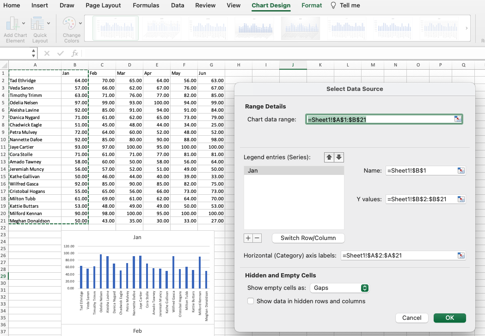
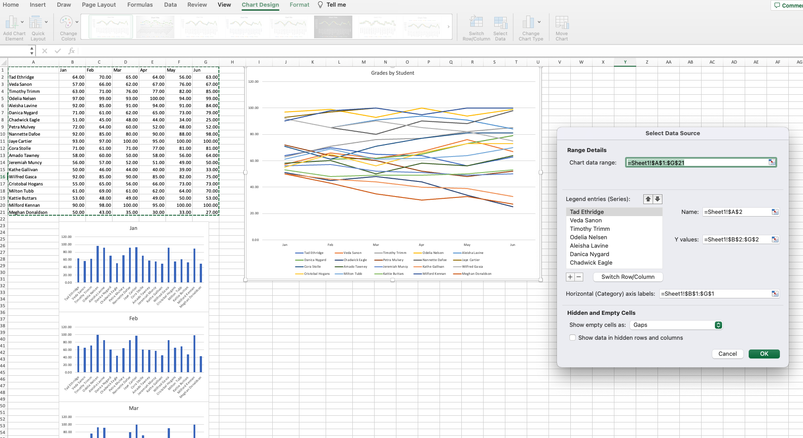

# Line and Bar Grades

Create a series of bar and line graphs that visualize the grades of a class over the course of a semester.

## Instructions

- Create a series of bar graphs that visualize the grades of all students in the class, one graph for every month.

## Completed

- Create a line graph using all of the data that can be used to compare students' grades across the semester.

  - Use filtering in the line graph to allow you to drill down to a specific student's progress throughout the semester.

## Completed

