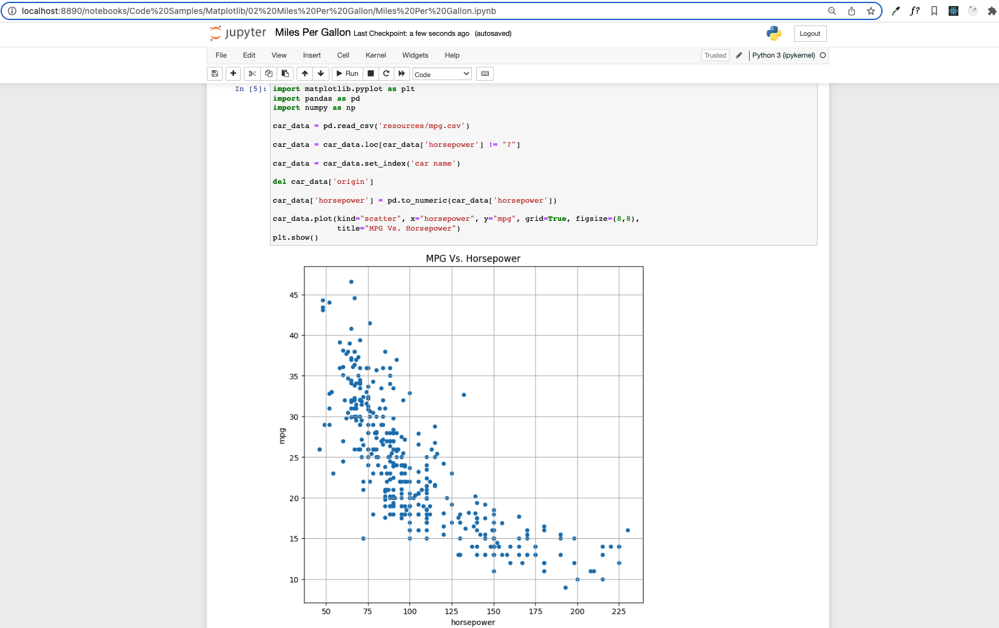

# Miles Per Gallon

## Instructions

- Create a scatter plot using the data provided, Pandas, and Matplotlib, that compares the miles per gallon of a vehicle with its horsepower.

## Completed

Data Source: [Auto MPG Dataset](https://archive.ics.uci.edu/ml/datasets/auto+mpg).
