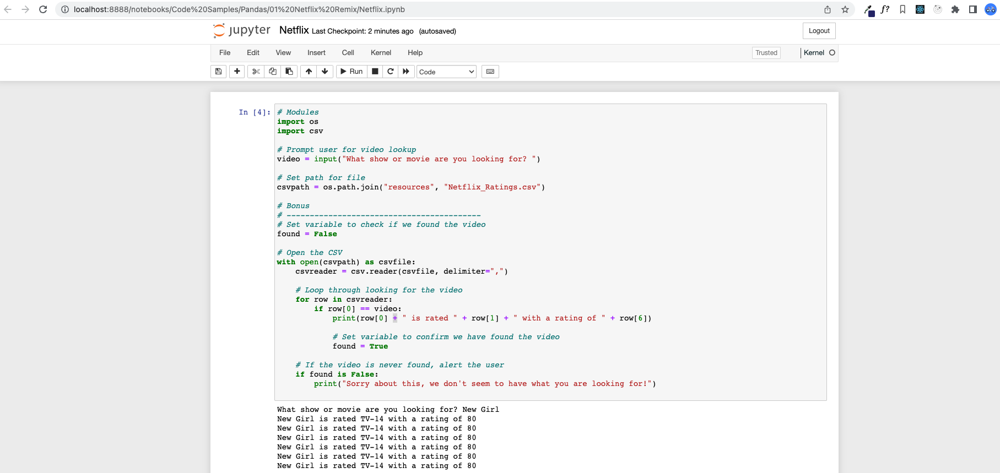
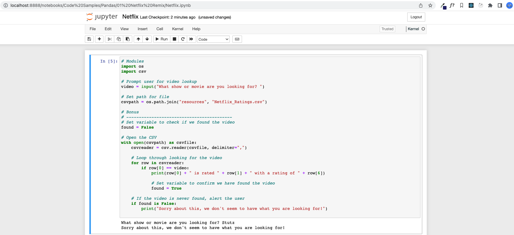

# Netflix Remix

## Instructions

- Using `Netflix.py` as a jumping off point, convert the application so that it runs properly within a Jupyter Notebook.

<!-- conda create -n PythonData -->

<!-- conda activate PythonData -->

<!-- pip3 install jupyter -->

<!-- jupyter notebook -->

<!-- conda install -c anaconda nb_conda_kernels -->

- Make sure to have the application print out the user's input, the path to `Netflix_Ratings.csv`, and the final rating/review for the film in different cells.

## Completed

