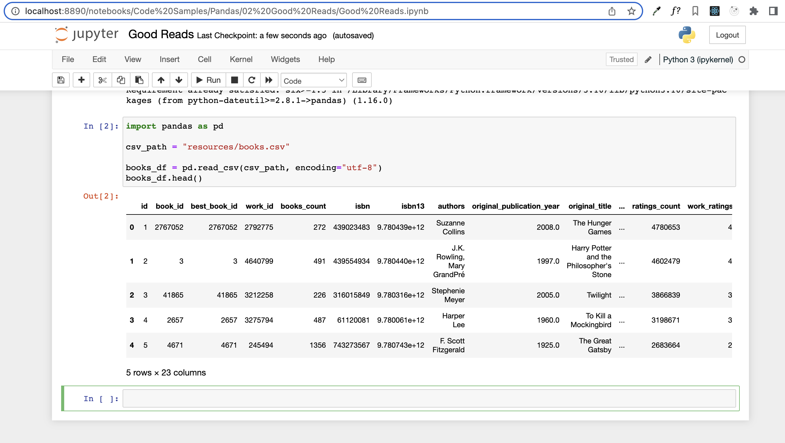
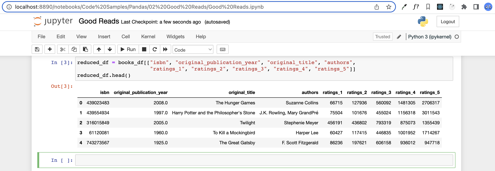
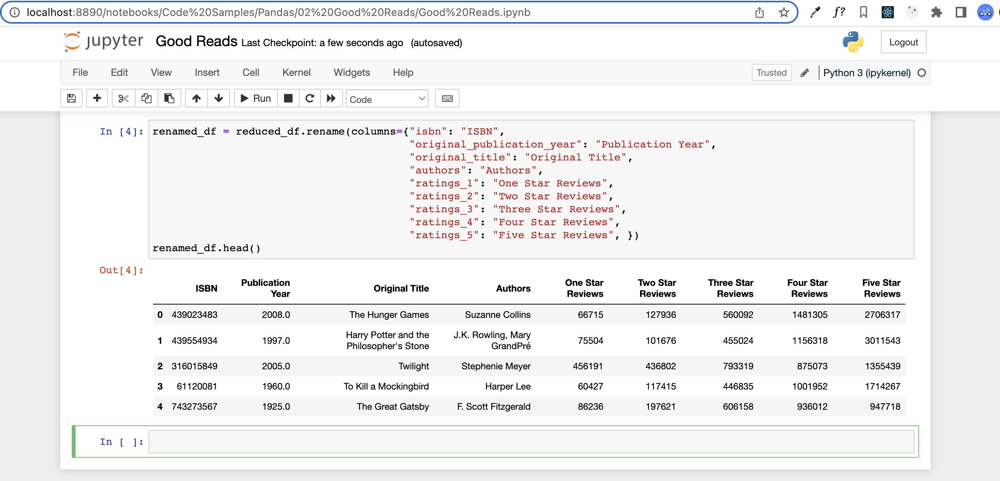
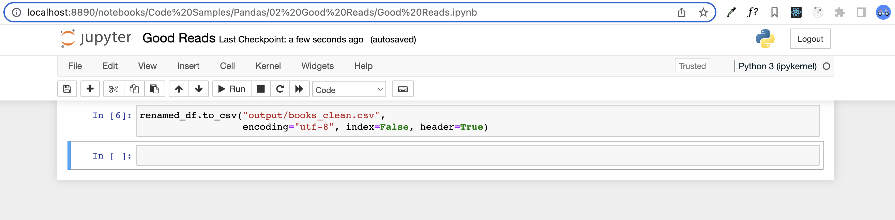

# Good Reads

## Instructions

- Read in the GoodReads CSV using Pandas

## Completed

- Remove unnecessary columns from the DataFrame so that only the following columns remain: `isbn`, `original_publication_year`, `original_title`, `authors`, `ratings_1`, `ratings_2`, `ratings_3`, `ratings_4`, and `ratings_5`

## Completed

- Rename the columns to the following: `ISBN`, `Publication Year`, `Original Title`, `Authors`, `One Star Reviews`, `Two Star Reviews`, `Three Star Reviews`, `Four Star Reviews`, and `Five Star Reviews`

## Completed

- Write the DataFrame into a new CSV file

## Completed

Data Source: [GoodReads Dataset](http://fastml.com/goodbooks-10k-a-new-dataset-for-book-recommendations/)
