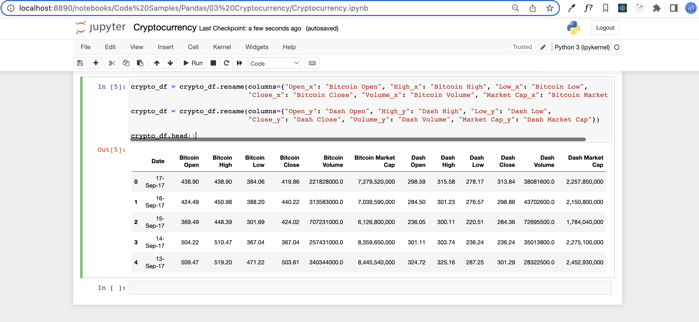

## Cryptocurrency

### Instructions

- Read in both of the CSV files and print out their DataFrames.

## Completed

- Perform an inner merge that combines both DataFrames on the "Date" column.

## Completed

- Rename the columns within the newly merged DataFrame so that the headers are more descriptive.

## Completed

- Create a summary table that includes the following information: `Best Bitcoin Open`, `Best Dash Open`, `Best Bitcoin Close`, `Best Dash Close`, `Total Bitcoin Volume`, `Total Dash Volume`. `Total Bitcoin Volume` and `Total Dash Volume` should be calculated to have units of "millions" and be rounded to two decimal places.

## Completed

