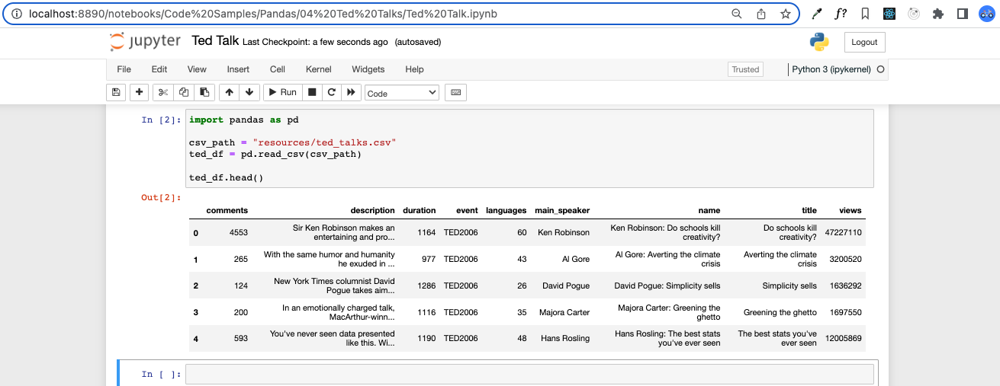
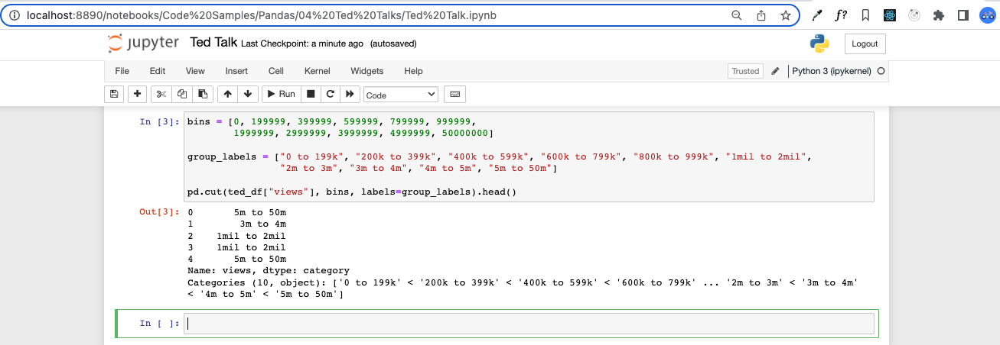
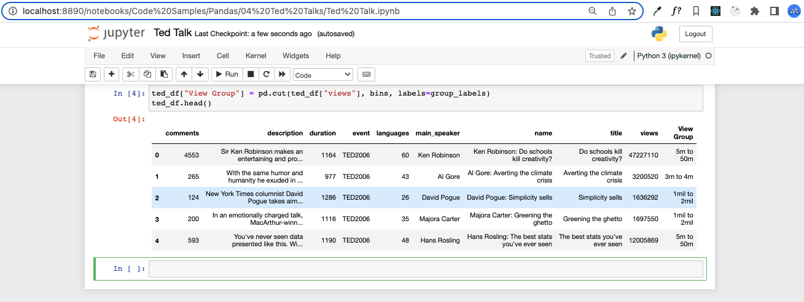
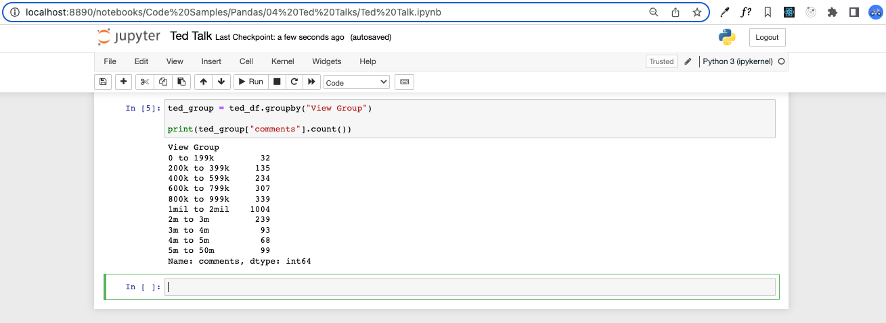
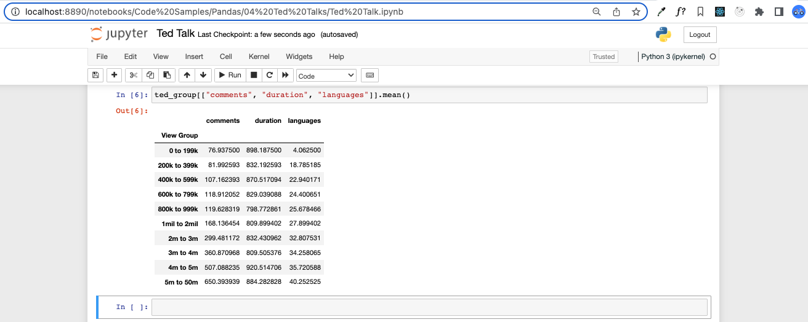

## Ted Talks

### Instructions

- Read in the CSV file provided and print it to the screen.

## Completed

- Using the minimum and maximum "views" as a reference, create 10 bins in which to slice the data. Create a new column called "View Group" and fill it with the values collected through your slicing.

## Completed

- Group the DataFrame based upon the values within "View Group".

## Completed

- Find out how many rows fall into each group before finding the averages for "comments", "duration", and "languages".

## Completed

Data Source: [Ted Talk Dataset](https://www.kaggle.com/rounakbanik/ted-talks)
