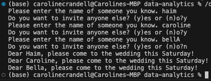

# List Comprehensions

In this activity, you will use list comprehensions to compose a wedding invitation to send to every name on your mailing list.

## Instructions

- First, use list comprehensions to create a new list that contains the lowercase version of each of the names your user provided.

- Then, use list comprehensions to create a new list that contains the title-cased versions of each of the names in your lower-cased list.

## Completed

