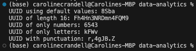

# UUID Generator

In this activity, you will generate a universally unique ID (UUID) string using functions and module imports.

## Instructions

- Create a function that returns a universally unique ID (UUID).

  - The function should accept a parameter for UUID length with the default size of 4.

  - The function should accept a parameter for a string of characters.

    - This string of characters will be the alphabet used to generate the UUID.

    - For example, if we pass `'abcdef'`, the UUID can only consist of the letters 'abcdef'.

  - The length and characters parameters should be optional and have default values.

  - Define a default character alphabet using the constants provided by the string module.

  - To select random characters for your UUID, use one of the functions available for sequence selection in the random module to randomly select a character from the alphabet.

- Complete the test function to generate a variety of UUIDs and print them to the console.

## Hints

- Define a default character alphabet that combines ASCII letters with digits.

- The code for the UUID function should create a list, append `length` random characters to the list, and then return the result of using `join` to create a string from it.

## Completed

