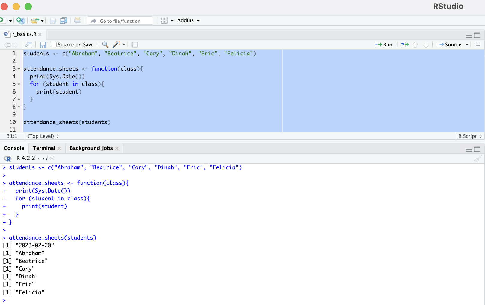
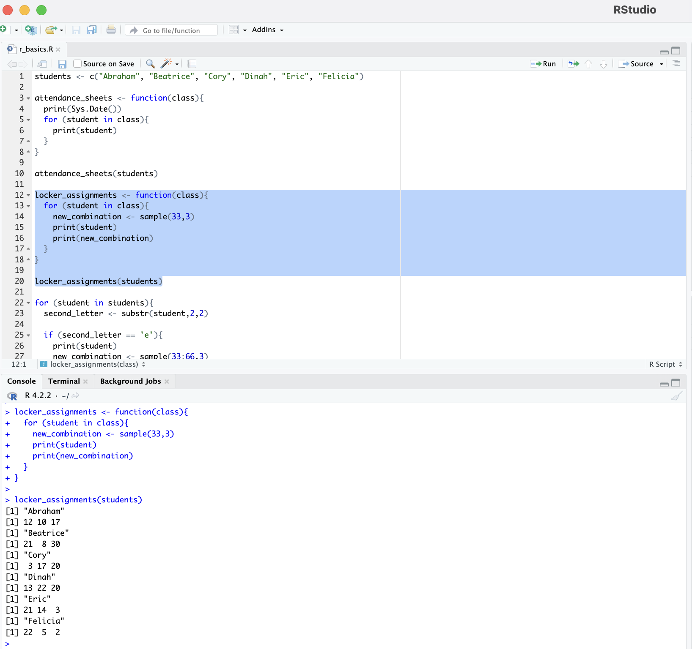
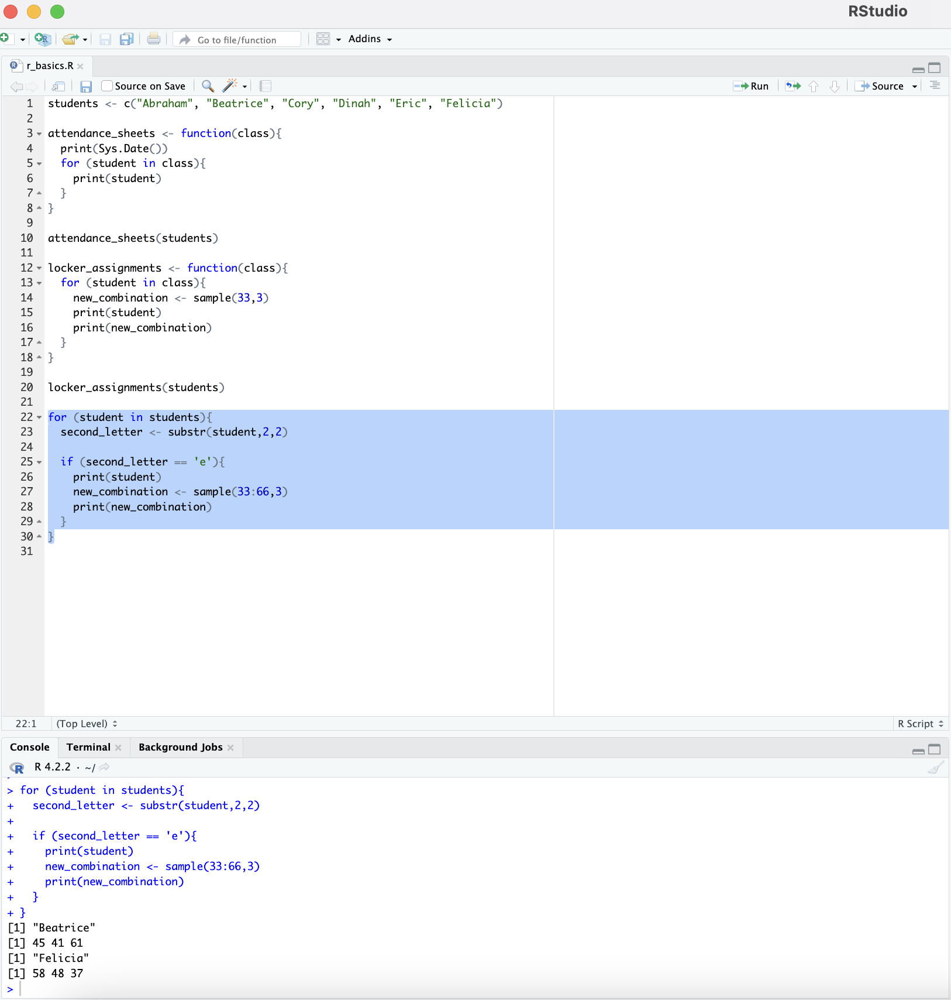

# We R in Junior High Again

## Instructions

- You are the homeroom teacher of a class of junior high students, and it is the first day of the school year. You will use R to automate some of the tasks, such as generating daily attendance sheets, and creating locker combinations.

### Part I

- Create a vector of the following students:

  - Abraham
  - Beatrice
  - Cory
  - Dinah
  - Eric
  - Felicia

- Using the vector, create a function that will print daily attendance sheets, with today's date printed at the top. Then use a for-loop to print each student's name.

## Completed

### Part II

- Each student will be assigned a locker, and as their teacher, you are responsible for resetting the combinations to the locks. Create a function that will create a randomly-generated combination for each student. The combination should be three numbers, each ranging from 1 to 33.

## Completed

### Part III

- Massive security breach! A hacker has accessed the combinations of all students the second letter of whose name is `e`. Print the name of each of these students, as well as a randomly generated combination of three numbers between 34 and 66.

## Completed

