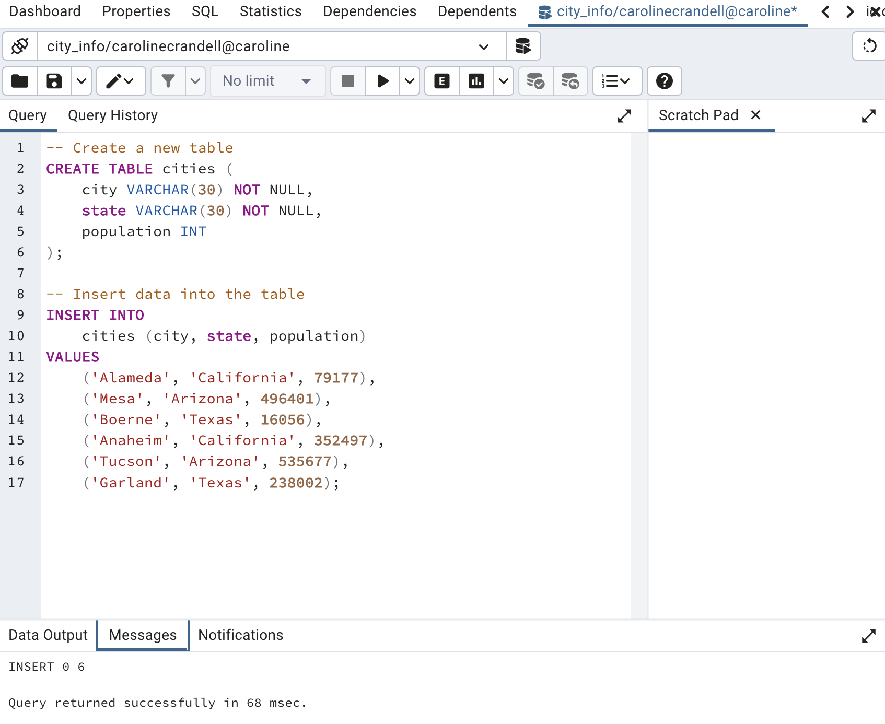
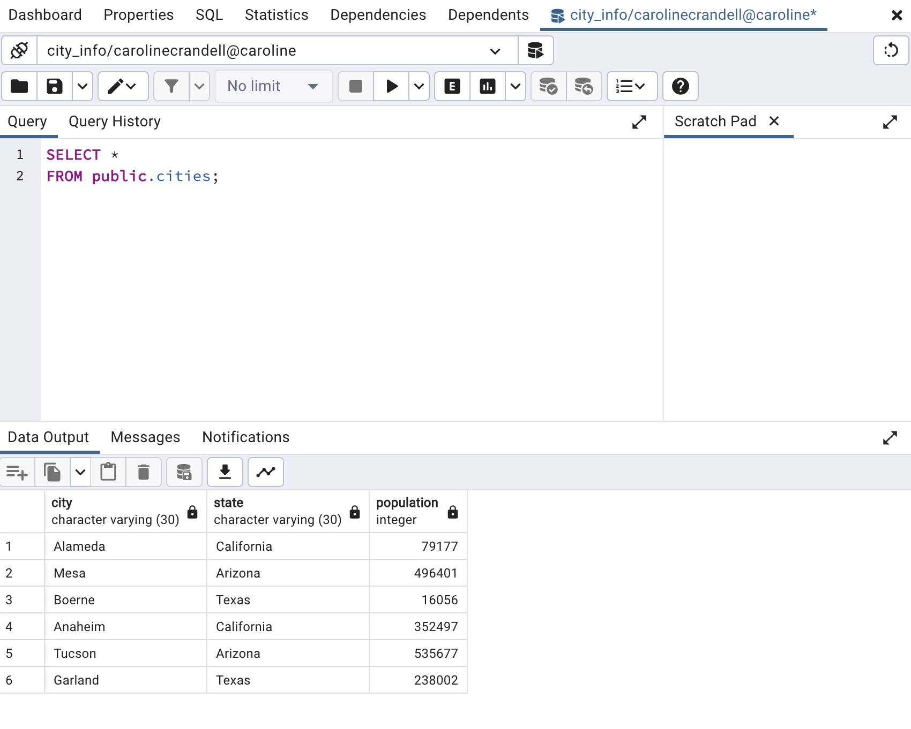
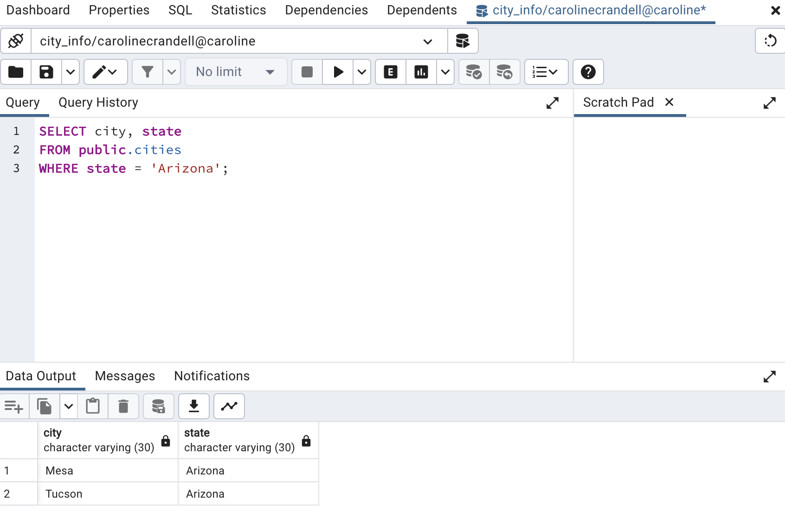
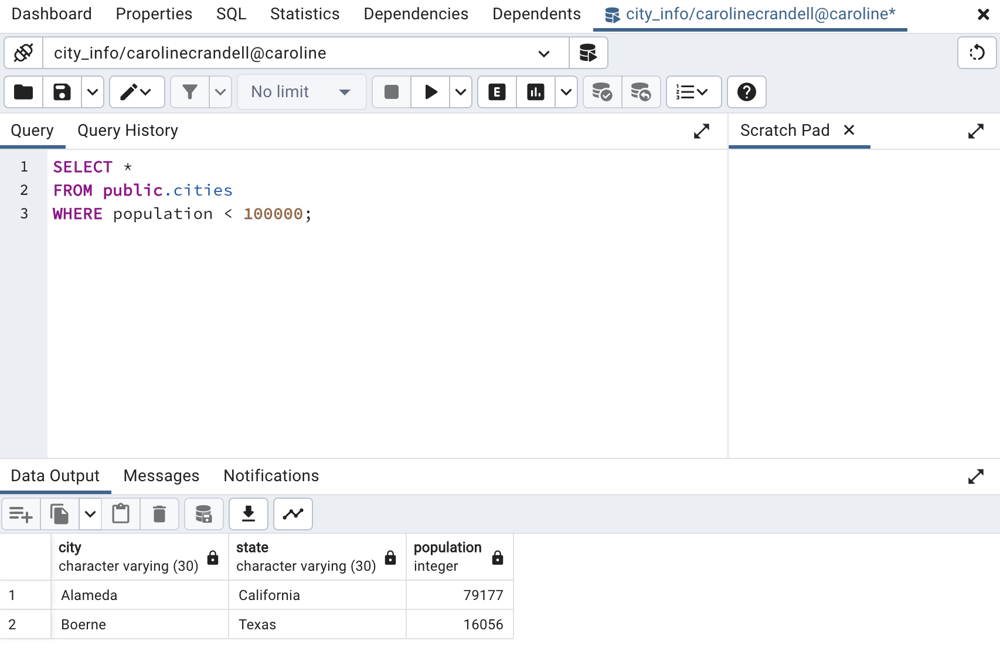
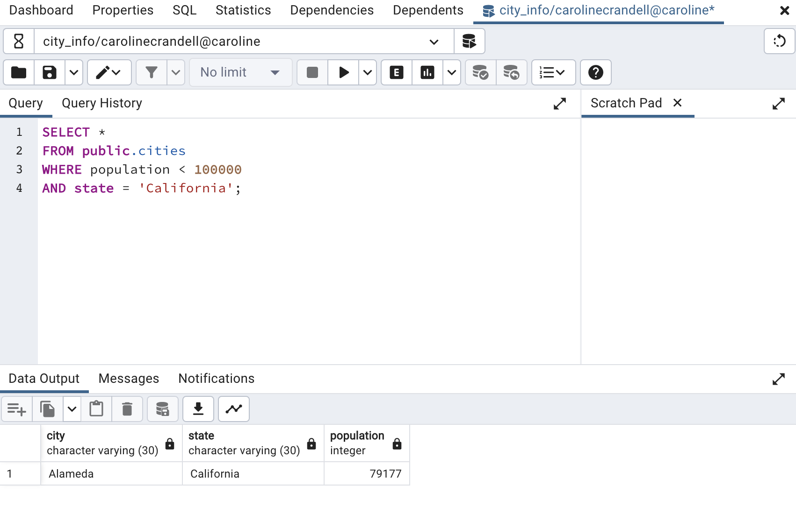

## Creating Tables

### Instructions

1. Create a new database in pgAdmin named `city_info`.

2. Using the query tool, create an empty table named `cities`.

3. Insert data into the new table.

### Bonus

1. Filter the table to view only cities in Arizona.

2. Filter the table to view only cities with a population of less than 100,000.

3. Filter the table to view California cities with a population of less than 100,000.

