## Making and Using an ID

### Instructions

1. Create a new database named `programming_db`.

2. Create the `programming_languages` table.

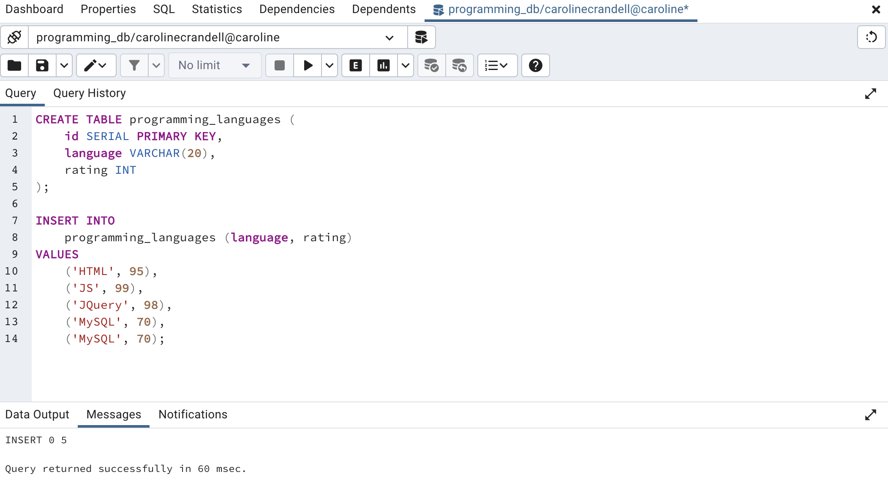
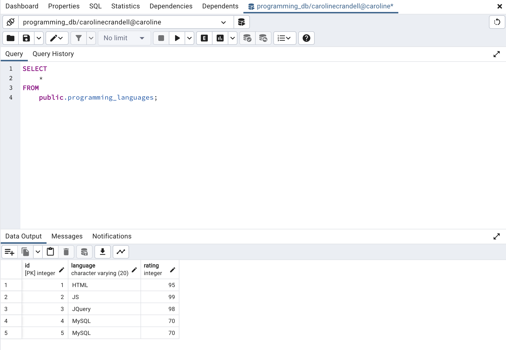

3. Query the table to return the rows containing MySQL, and then delete one of the duplicates.

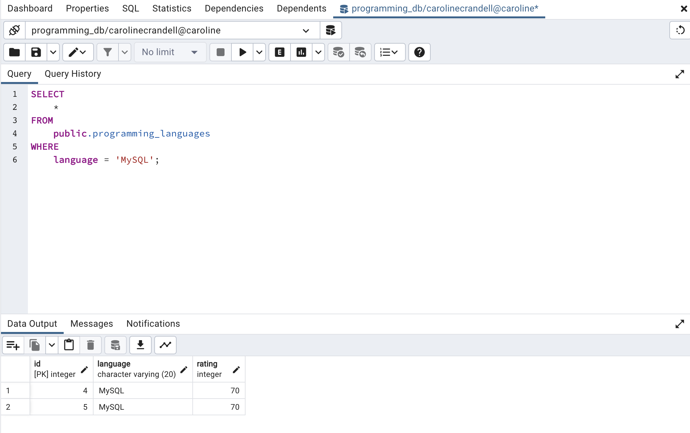
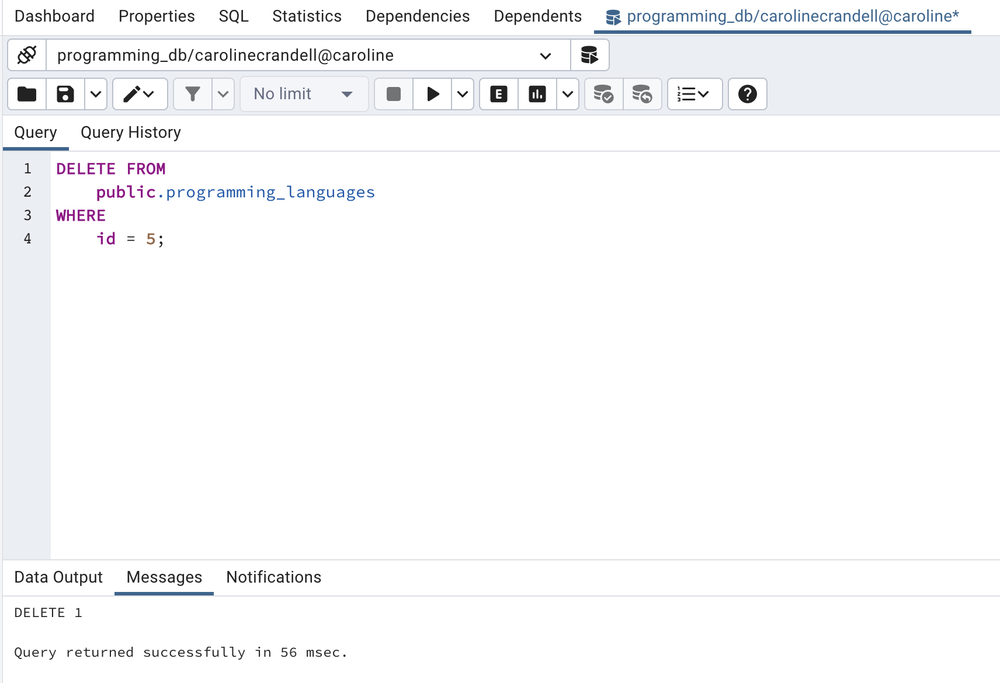
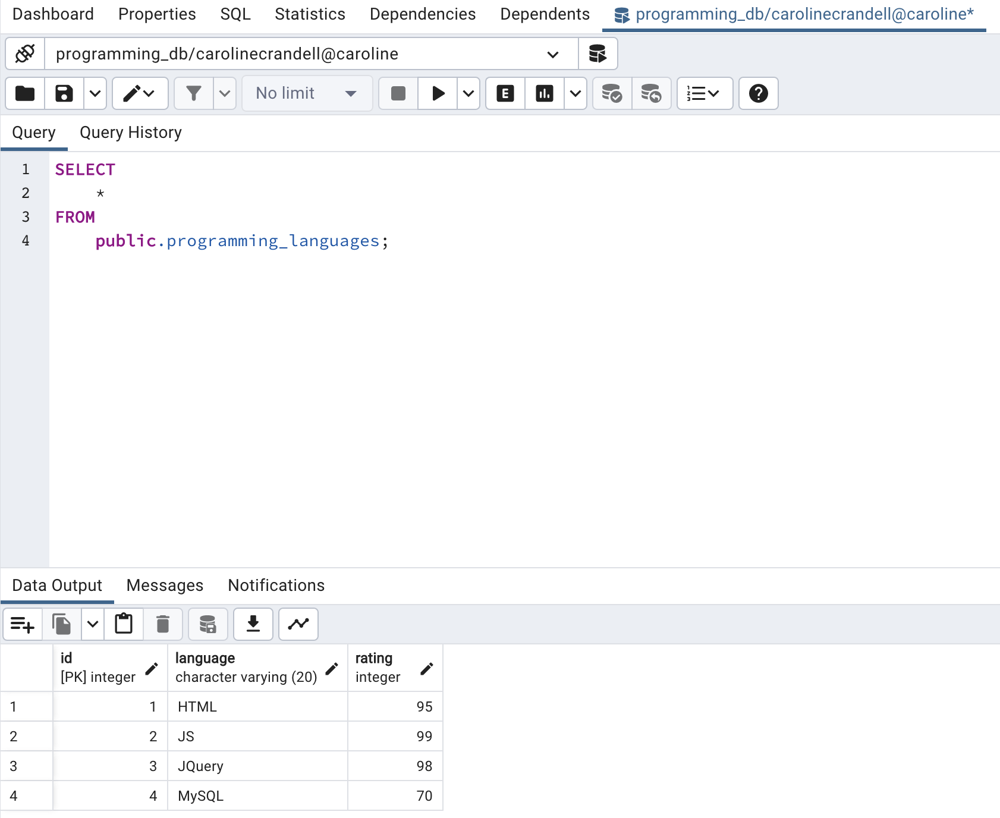

4. Insert a few more rows of data for additional programming languages by adding the `language` and `rating` of your choice to the `programming_languages` table.

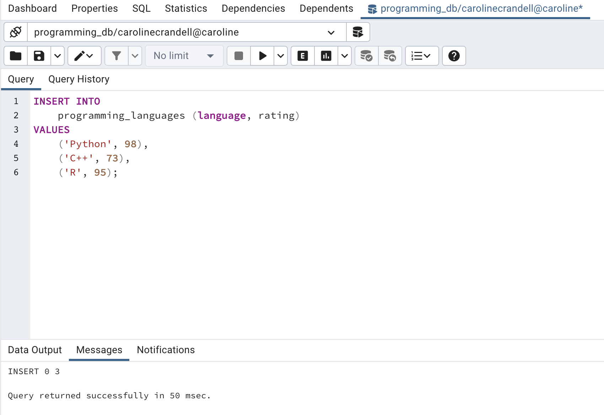
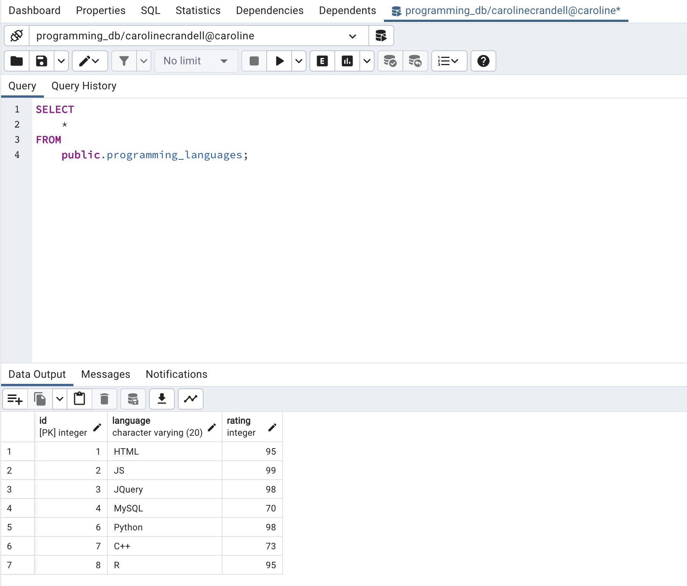

5. Change the name of the JS language to JavaScript.

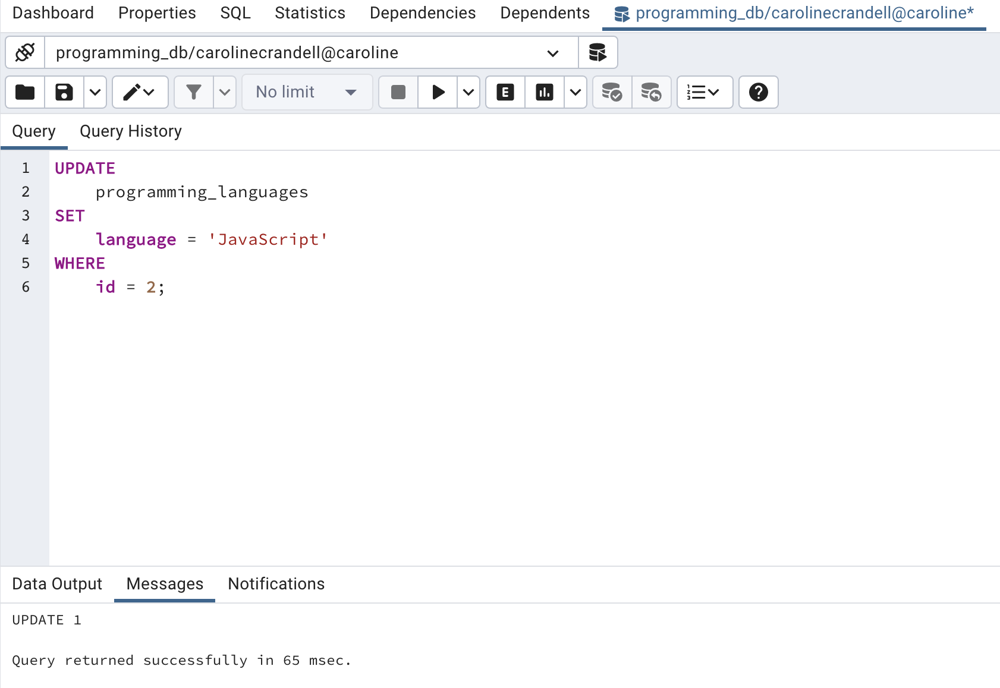
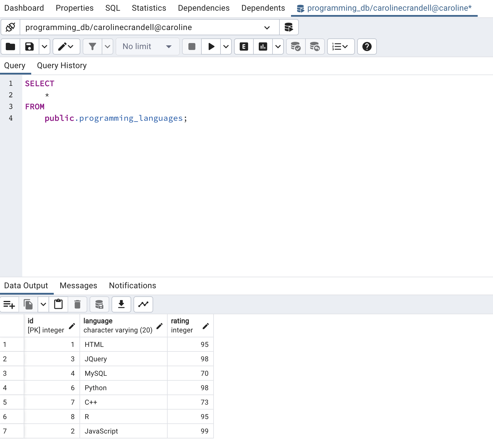

6. Change the rating for HTML to 90.

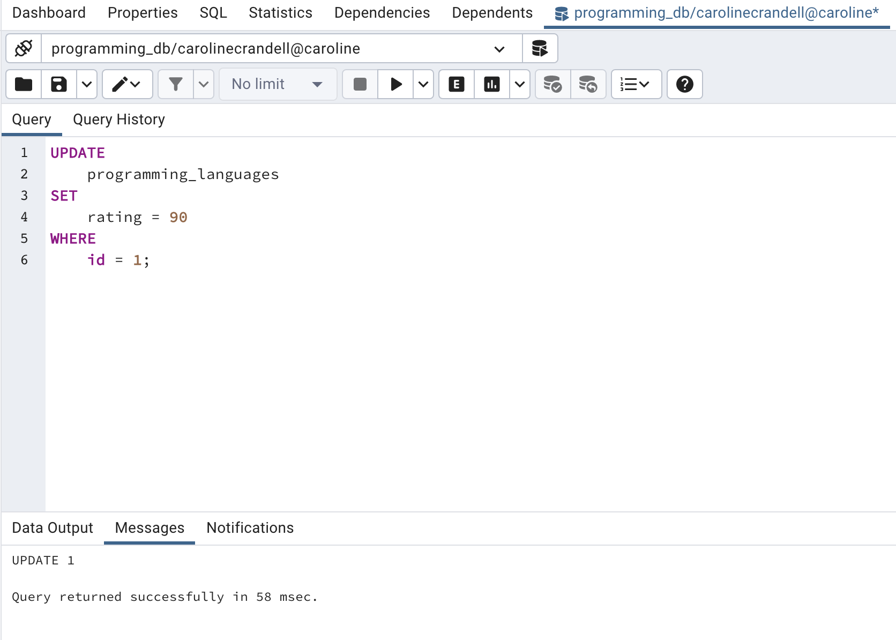
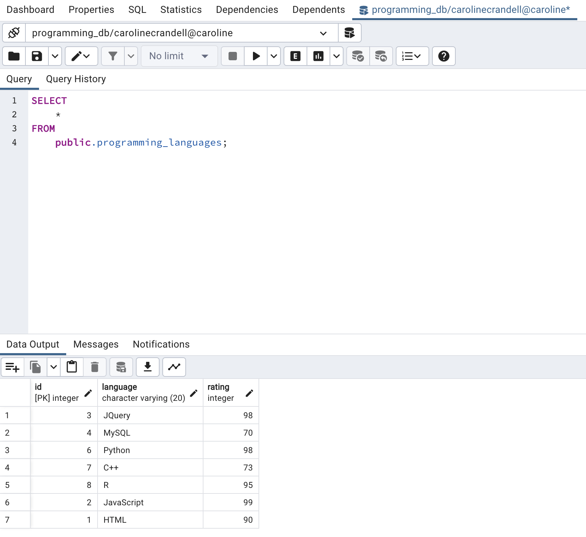

### Bonus

- Create a Boolean column named `mastered` that has a default value of `true`.

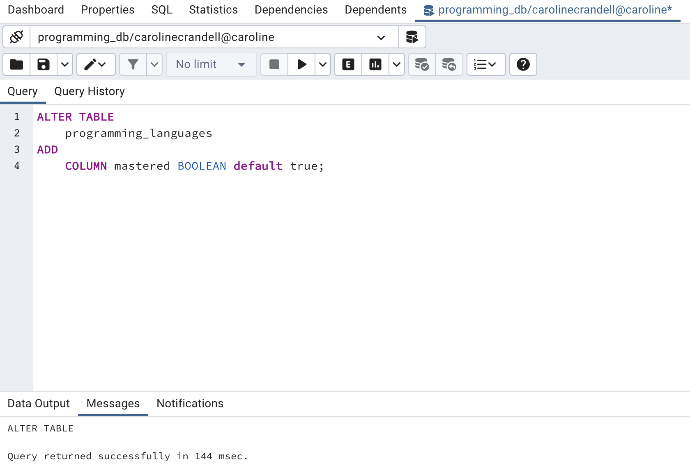
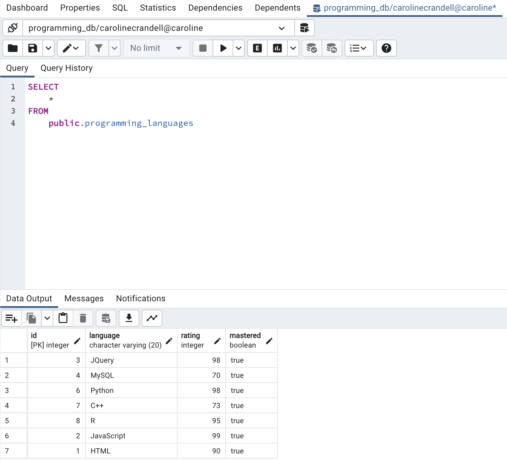
