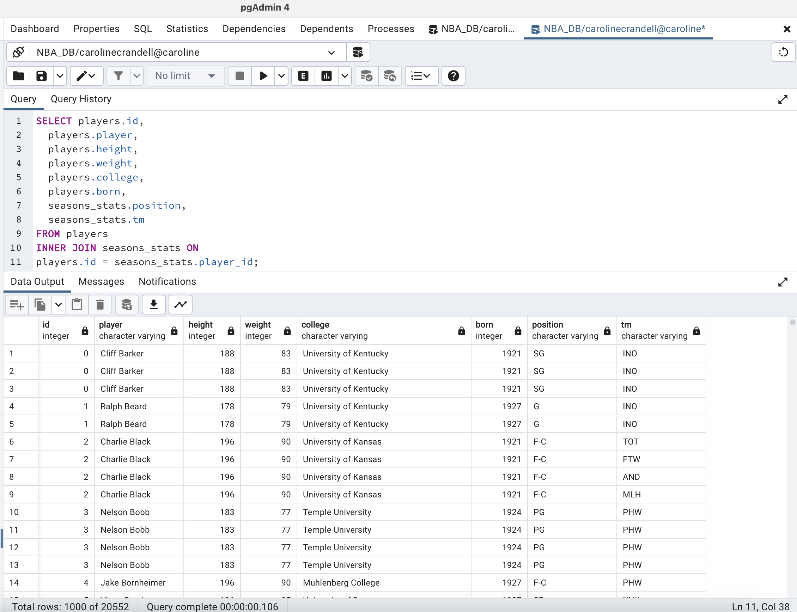

# Joins

In this activity, you will be using joins to query NBA player seasonal statistics.

### Instructions

1. Create a new database named `NBA_DB` and create two new tables with pgAdmin named `players` and `seasons_stats`.

2. Import the corresponding data from `Players.csv` and `Seasons_Stats.csv`.

3. Perform joins that will generate the following outputs:

Basic Information Table:

Percent Stats:

## Completed

