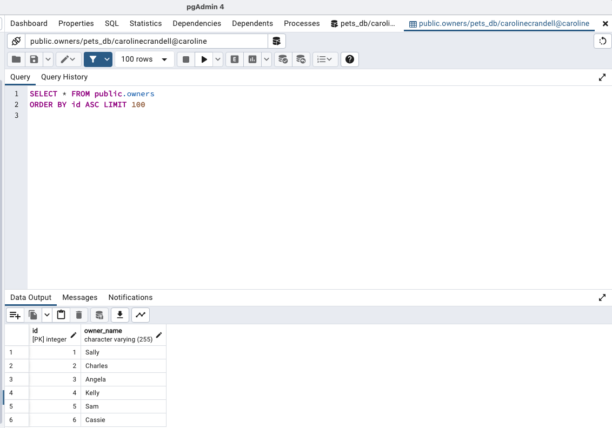
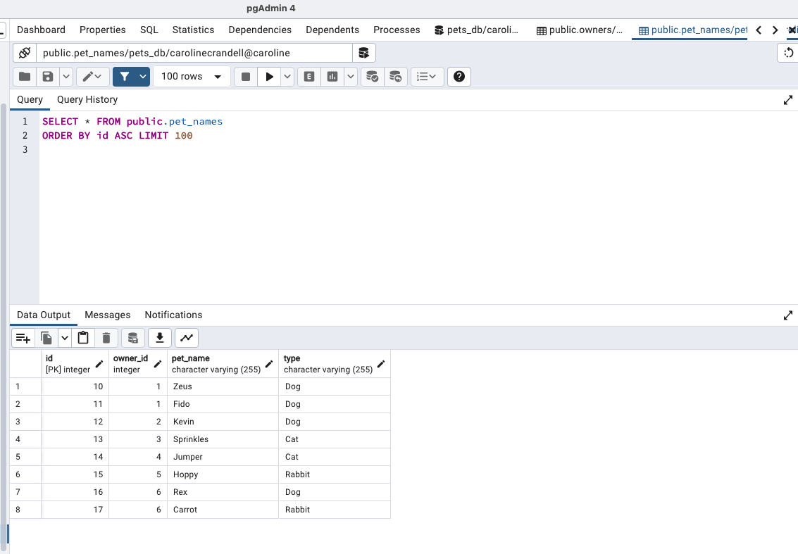
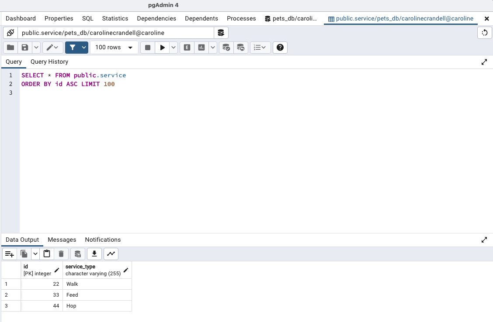
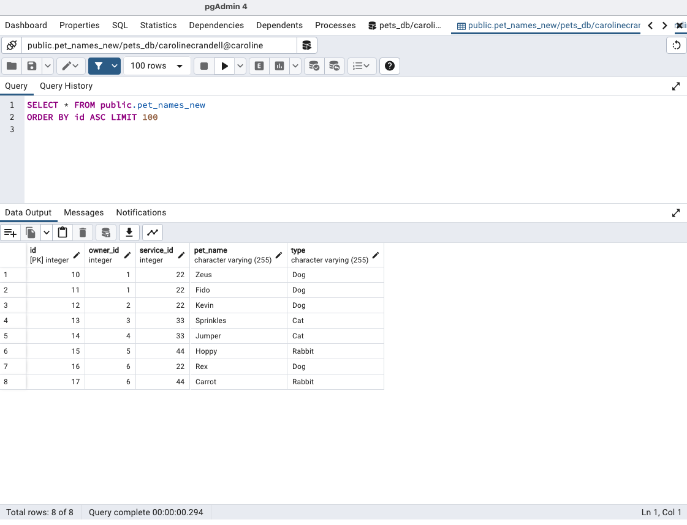
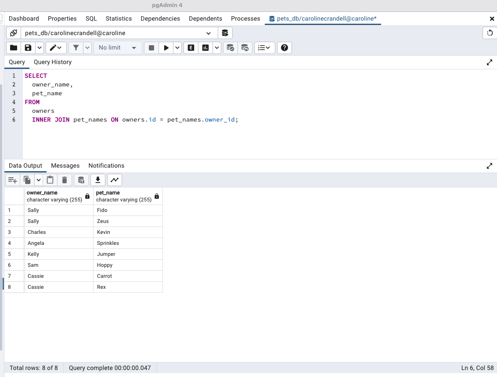
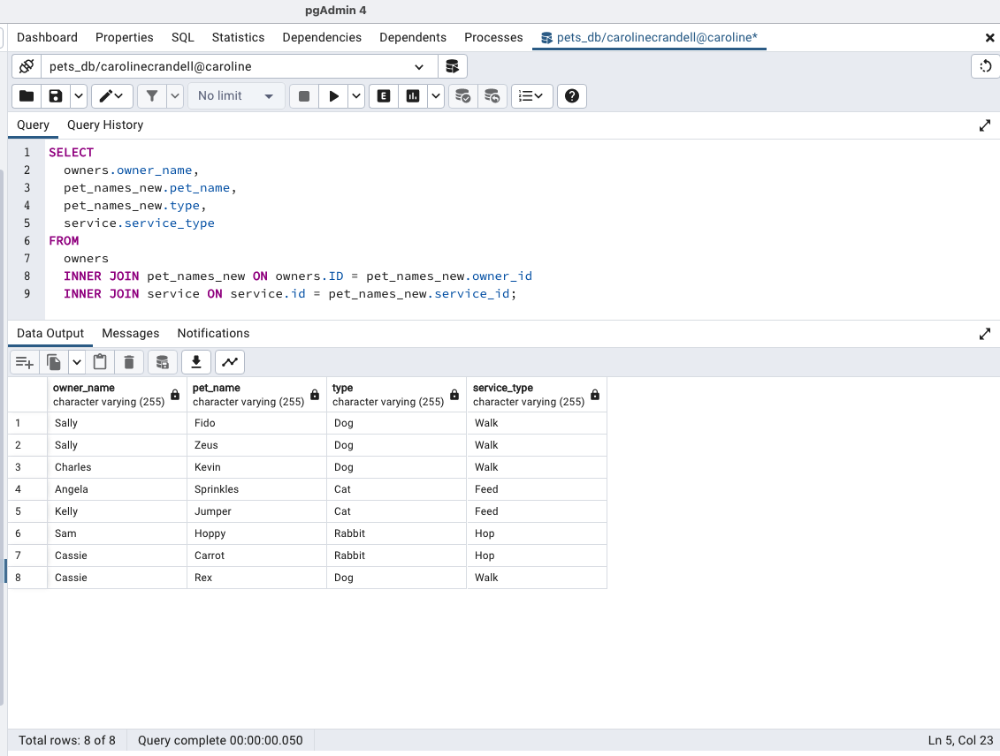

## Data Normalization

In this activity, you will be utilizing data normalization practices.

### Instructions

- In pgAdmin, create a new database called `pets_db`.

- Use Excel to get the data into first normal form (1NF).

- Using the normalized CSV, create the following tables with continued normalized practices:

  - A table for owners that takes an ID and the owner's name

  ## Completed

  

  - A table for pet names that takes two IDs, the pet's name, and the pet's type.

  ## Completed

  

- Using the CSV file as guide, insert the data into respective tables.

### Bonus

- Create a `service` table that displays the different types of services that are offered.

## Completed

- Create a `pet_names_updated` table that takes an ID that will connect to the `services` table.

## Completed

- Join all three tables.

## Completed

