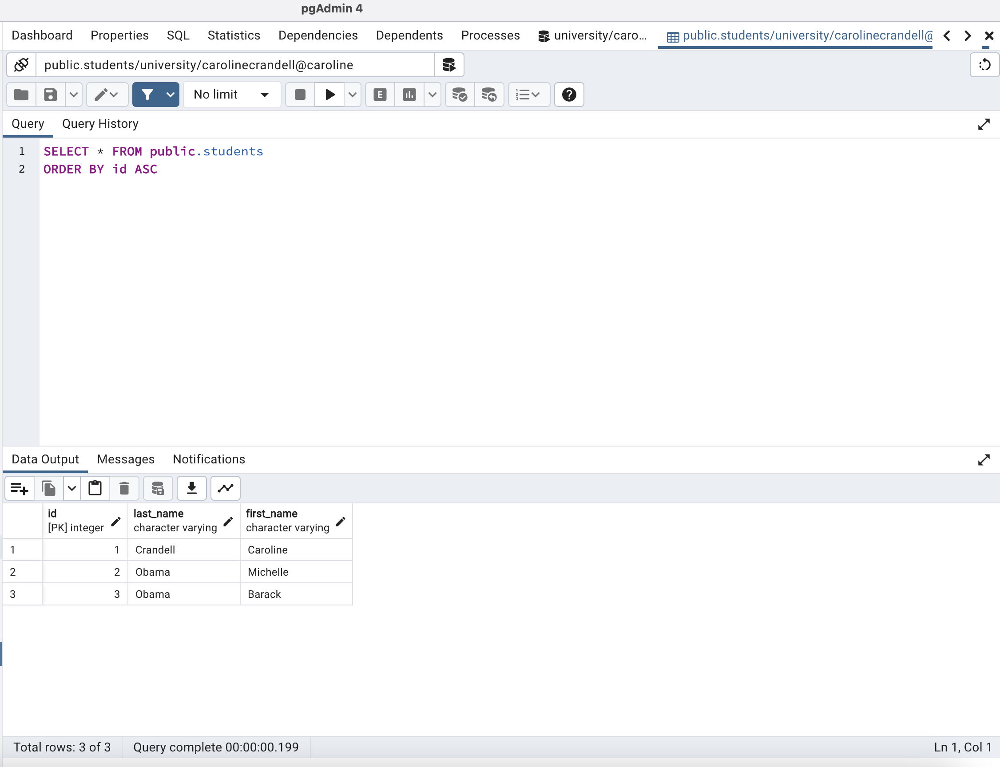
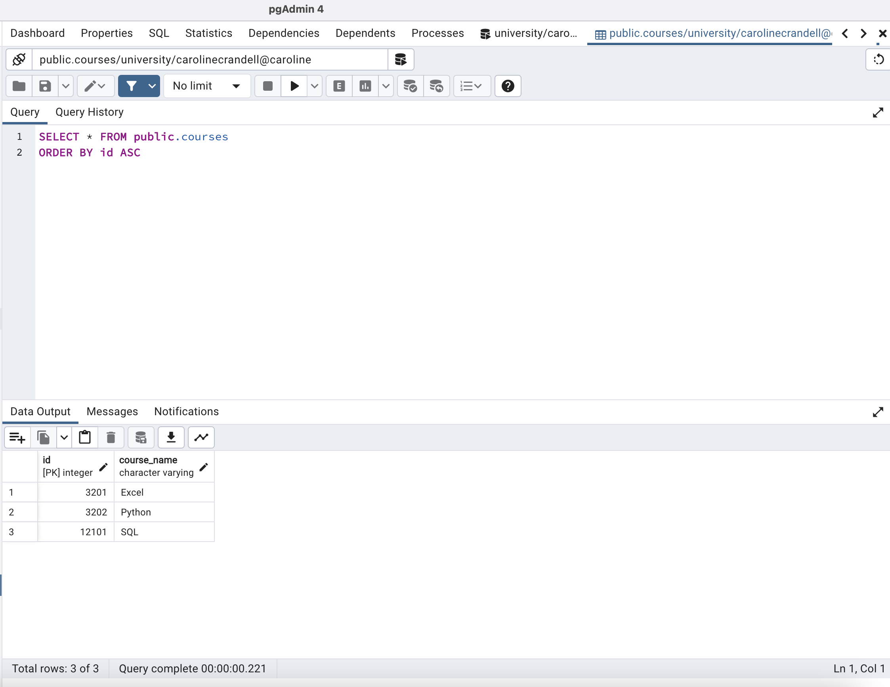
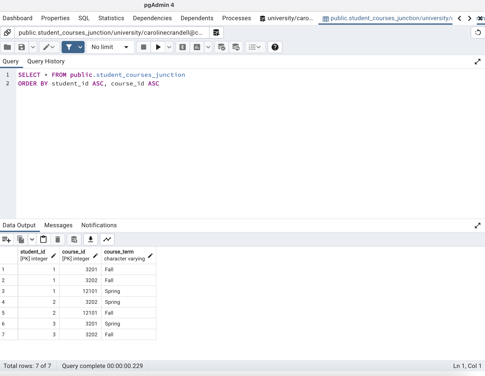
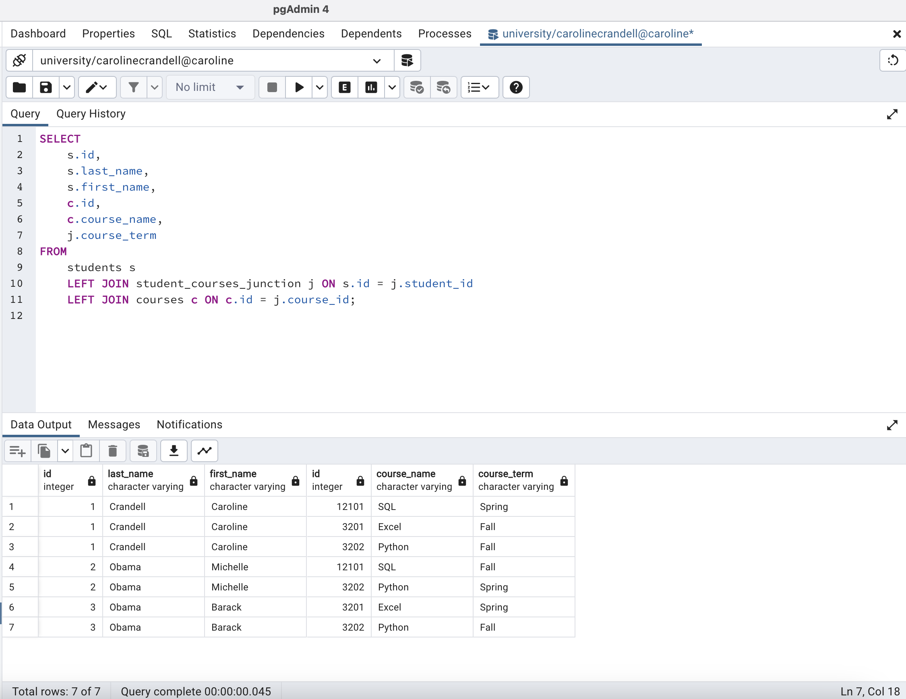

## Data Relationships

In this activity, you will design a database model.

### Instructions

You are the database consultant at a new university. Your job is to design a database model for the registrar. The database will keep track of information on students, courses offered by the university, and the courses each student has taken.

- Create a `students` table that keeps track of the following:

  - Unique ID number of each student
  - Last and first names of each student

## Completed

- Create a `courses` table that keeps track of the following:

  - Unique ID number of each course
  - Name of each course

## Completed

- Create a `student_courses_junction` that keeps track of the following:

  - All courses that have been taken by each student
  - Term in which a course was taken by a student (Spring or Fall)

## Completed

### Bonus

Join and query the tables to get all data on the students.

## Completed

