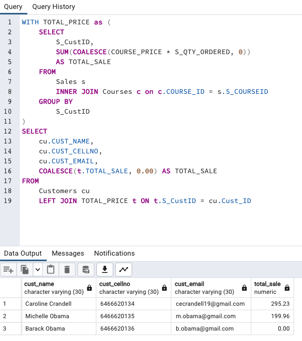

## Merge

### Instructions

There are three tables: `Customers`, `Sales`, and `Courses`. Write a query that returns customer data and the amount they have spent on courses. The query should return the following results:

```
cust_name | cust_cellno | cust_email | total_sale
Caroline Crandell | 6466620134 | cecrandell19@gmail.com | 295.23
Michelle Obama | 6466620135 | m.obama@gmail.com | 199.96
Barack Obama | 6466620136 | b.obama@gmail.com | 0.00
```

## Completed


