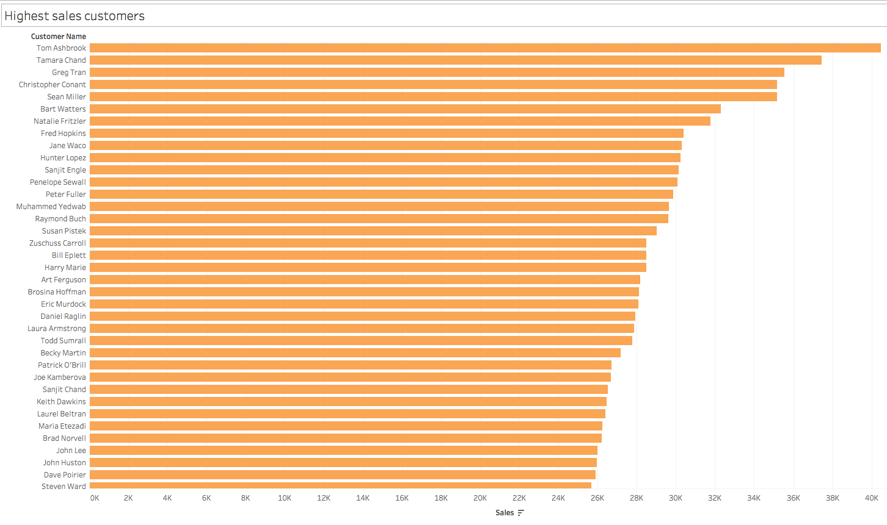
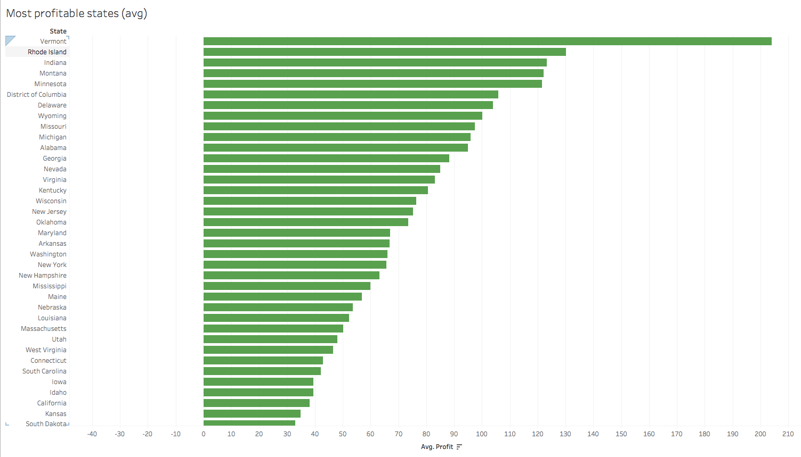

# Data Exploration with Tableau

## Instructions

- Using the `GlobalSuperstoreOrders2016.xlsx` workbook, visualize the following:

1. The customers with the highest sales amount

   

## Completed

2. The most profitable customers

   

## Completed

3. The states with the highest average profit

   

## Completed

4. A monthly timeline of sales

   

## Completed

5. Profit by region and product category (in the United States).

   

## Completed

