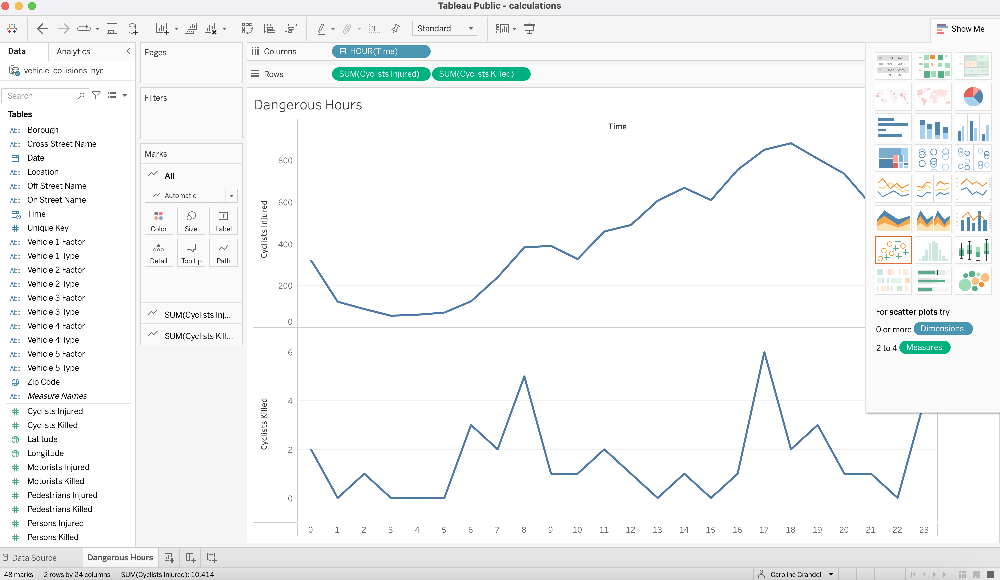
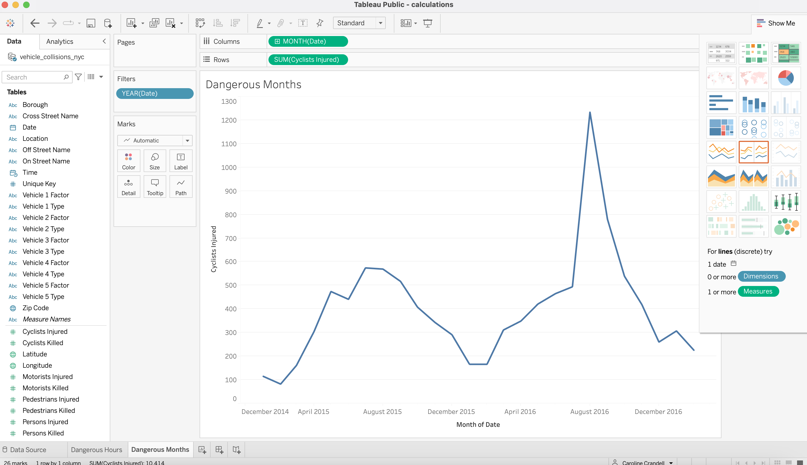
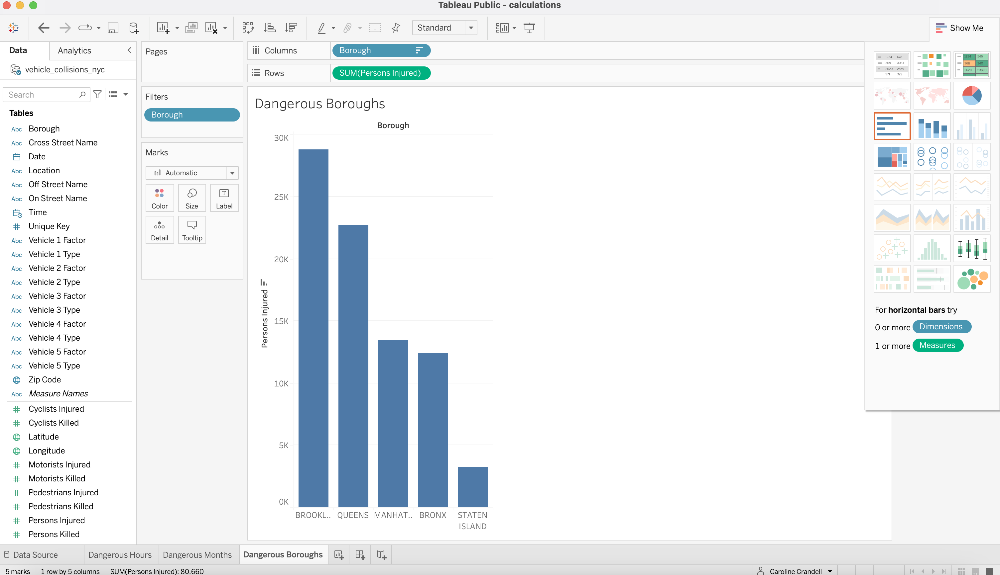
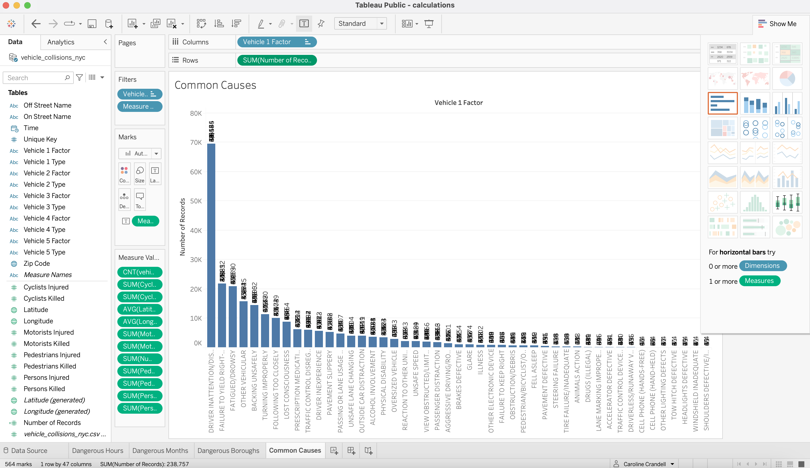
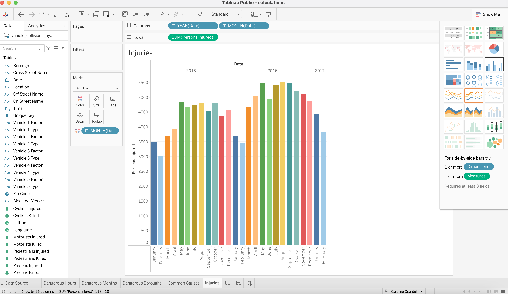

# Calculations

## Instructions

- The data set you have been given is on motor vehicle accidents in New York City.

- Try to create visualizations to the following questions:

  - What are the most dangerous hours for cyclists in a day?

  ## Completed

   

  - What are the most dangerous months for a cyclist?

  ## Completed

   

  - What are the most dangerous boroughs?

  ## Completed

   

  - What are the most common causes of accidents?

  ## Completed

   
   
  - How many people have been injured during each month?

  ## Completed

   
