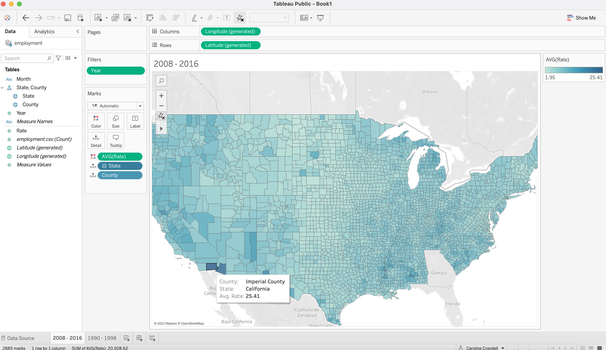
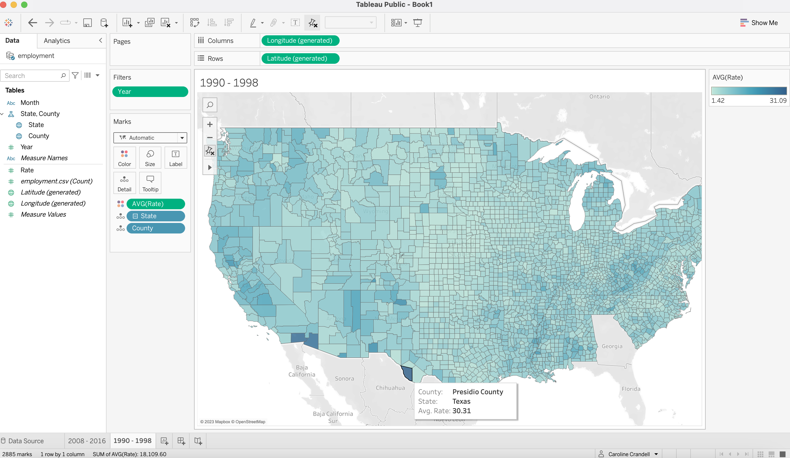

# Unemployment Map

## Instructions

- Use `employment.csv`, a dataset constructed from the Bureau of Labor Statics data, to visualize unemployment in the United States.

- Create a map of unemployment between 2008 and 2016, by county. Which areas in the United States have been the hardest hit during that period?

  ## Completed

   

- Create an unemployment map, by county, during the period 1990-1998. How does it compare and contrast with the map from 2008-16?

  ## Completed

   
